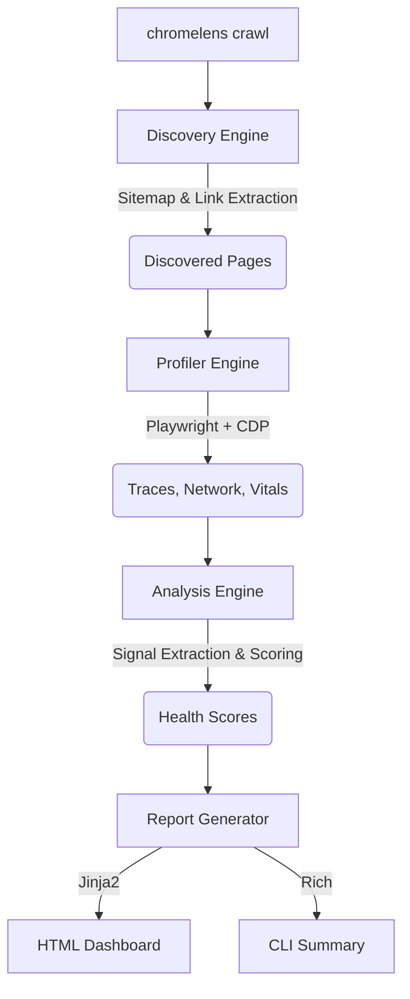

# 🔬 ChromeLens

**Full-site performance X-ray powered by Chrome DevTools Protocol traces.**

ChromeLens is a Python CLI tool that crawls an entire website, captures Chrome DevTools Protocol (CDP) traces for every page, extracts deep rendering-pipeline bottleneck signals, and generates a visual interactive dashboard.

Unlike standard tools (like Lighthouse) that test single URLs and provide surface-level Web Vitals, ChromeLens profiles **every reachable page** on your site, extracting sub-metric signals like V8 JavaScript compile times, layout thrashing events, and granular third-party script impact.

<!-- Insert sample screenshot of the dashboard here later -->

---

## 🚀 Features

- **Full-Site Crawling:** Automatically discovers and profiles pages using `sitemap.xml` and recursive Playwright link extraction. Discards external links and obeys `robots.txt`.
- **Deep Trace Profiling:** Uses CDP `Performance.enable` and `Tracing.start` to capture low-level Chrome rendering metrics (Long Tasks, Layout Count, GC Pauses, Script Duration).
- **Web Vitals Extraction:** Surfaces LCP, FCP, CLS, TTFB, and DOM interactive metrics via `PerformanceObserver`.
- **Third-Party Impact Scoring:** Groups all network requests by domain, highlighting which third-party scripts block rendering or bloat your page weight across the site.
- **Interactive Dashboard:** Generates a single-file, zero-dependency HTML dashboard report with performance color coding, charts (built with Chart.js), and per-page deep dives.
- **CI/CD Ready:** Includes a rich terminal summary output for fast regression detection in your pipelines.

---

## 🛠️ Architecture



ChromeLens is composed of 4 main engines:
1. **Discovery Engine:** Responsible for finding all same-origin pages up to a configured depth.
2. **Profiler Engine:** Launches headless Chromium via Playwright, establishes a CDP session, and records performance metrics and trace JSON.
3. **Analysis Engine:** Parses the raw trace JSON. It detects >50ms main-thread long tasks, counts layout/paint events, measures garbage collection (GC) duration, and aggregates network waterfall requests to grade performance.
4. **Report Generator:** Compiles insights into a clean, modern HTML dashboard and console output.

---

## 📦 Installation

ChromeLens requires Python 3.10+.

1. Clone the repository:
   ```bash
   git clone https://github.com/manishklach/chromelens.git
   cd chromelens
   ```

2. Install the package and dependencies:
   ```bash
   pip install -e .
   ```

3. Install the Playwright Chromium browser binary:
   ```bash
   playwright install chromium
   ```

---

## 🚦 Usage

Profile a website and output the HTML report to the `reports/demo` directory:

```bash
chromelens crawl https://example.com --output reports/demo --max-pages 10
```
*(If the `chromelens` command is not in your PATH, use `python -m chromelens.cli crawl ...`)*

### Options:
- `--output`, `-o`: Output directory for the HTML report and screenshots (default: `reports/chromelens`).
- `--max-pages`: Maximum number of pages to profile (default: `20`).
- `--max-depth`: Maximum crawl depth for link extraction (default: `3`).
- `--headless`/`--headed`: Run the browser invisibly (default) or visibly.
- `--screenshots`/`--no-screenshots`: Automatically capture full-page screenshots (default: `True`).

---

## 📊 Health Scoring Rubric

ChromeLens calculates a composite **0-100 Score** and **Letter Grade (A-F)** per page based on three pillars:

- **Web Vitals (45%):** Penalizes poor Largest Contentful Paint (LCP > 2.5s) and Cumulative Layout Shift (CLS > 0.1).
- **Performance (35%):** Penalizes high Total Blocking Time (TBT), >50ms long tasks, and excessive Garbage Collection (GC) pauses.
- **Network (20%):** Penalizes excessive page weight (>2MB) and heavy third-party payload sizes.

---

## 📋 License

Apache-2.0 License
