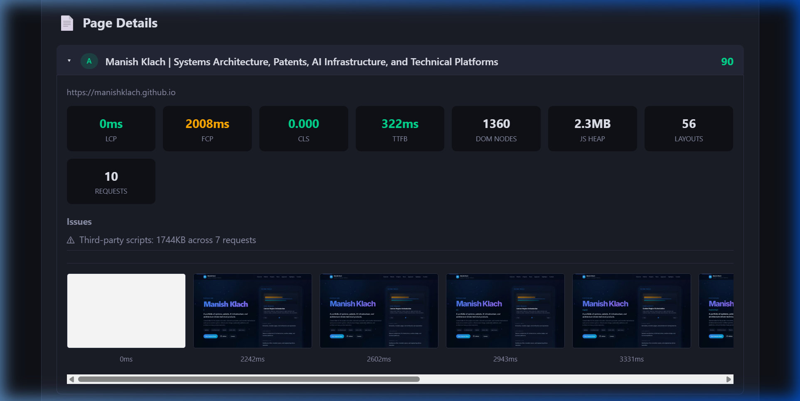
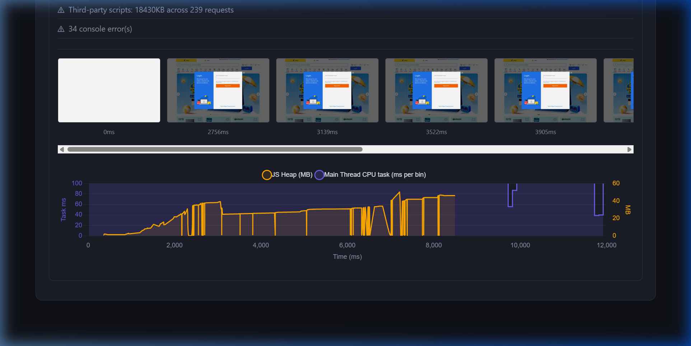
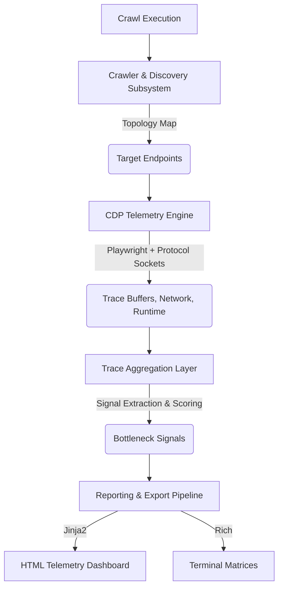

# 🔬 ChromeLens

**Fleet-wide deterministic CDP telemetry for modern web architectures.**

[](https://badge.fury.io/py/chromelens)
[](https://opensource.org/licenses/Apache-2.0)

ChromeLens is a systems-grade performance analysis engine. It crawls your entire web architecture, attaches Chrome DevTools Protocol (CDP) sockets to every route, and extracts low-level rendering pipeline traces to expose exactly what is blocking your main thread.

### The Telemetry Gap
Lighthouse is a snapshot. It tells you a single page is slow. 
**ChromeLens is an MRI. It maps rendering bottlenecks across your entire fleet.**

Instead of testing isolated URLs and guessing at Web Vitals, ChromeLens automates trace collection at scale—aggregating massive multi-megabyte trace payloads into deterministic bottleneck data (V8 compilation locks, layout thrashing, and unoptimized SPA hydration states).



*Watch the dashboard trace in action: [Dashboard Walkthrough Animation](assets/demo_walkthrough.webp)*

---

## 🚀 Core Capabilities

- **Automated Fleet Discovery:** Crawls and profiles entire site topologies concurrently via Playwright link extraction and sitemaps. Discards noise, obeys `robots.txt`.
- **Deterministic CDP Tracing:** Captures low-level Chrome metrics directly from the protocol (Long Tasks >50ms, Garbage Collection pauses, Paint counts, Script execution bounds).
- **Interactive Flow Telemetry:** Bypass static loads and programmatically script user journeys (clicks, form fills, SPA navigations) while continuously streaming hardware CPU and JS Heap utilization.
- **Third-Party Payload Mapping:** Aggregates network waterfalls by domain to expose exactly which underlying ad networks or analytics scripts are hijacking your render cycle.
- **CI/CD Ready:** Dumps machine-readable JSON artifacts and highly visual, zero-dependency HTML dashboards for immediate PR regression analysis.

---

## 🌊 Interaction Flow Profiling

ChromeLens includes an advanced mode where you can bypass the standard static crawl and write programmatic Playwright scripts to emulate full user journeys (like adding an item to a cart or navigating a complex SPA).



*Watch the dynamic chart react to simulated user interactions on Flipkart: [Demo Video](assets/flipkart_flow.webp)*

By implementing `interaction_fn` inside `profile_flow`, the engine captures the Javascript Heap accumulations and Main Thread CPU activity specifically triggered by user input, producing a hardware timeline synced perfectly to visual rendering filmstrips!

---

## 🛠️ Systems Architecture

ChromeLens is engineered across 4 distinct processing subsystems:



1. **Crawler & Discovery Subsystem:** Concurrently traverses DOM trees and sitemaps, respecting `robots.txt` and mapping same-origin topologies.
2. **CDP Telemetry Engine:** Interfaces directly with Playwright to stream low-level Chrome DevTools Protocol events (Tracing, Network, Runtime) into memory buffers.
3. **Trace Aggregation Layer:** Parses massive multi-megabyte JSON traces, isolating >50ms main-thread long tasks, identifying layout thrashing, and scoring third-party script bloat.
4. **Reporting & Export Pipeline:** Serializes the normalized data structures into deterministic HTML artifact drops and machine-readable data for CI ingestion.

---

## 📦 Quickstart

ChromeLens requires Python 3.10+.

1. Clone and Install ChromeLens:
   ```bash
   git clone https://github.com/manishklach/chromelens.git
   cd chromelens
   pip install -e .
   ```

2. Provision the Playwright Chromium binary:
   ```bash
   playwright install chromium
   ```

3. Profile a target architecture (outputting to `reports/telemetry`):
   ```bash
   chromelens crawl https://example.com --max-pages 20 --output reports/telemetry
   ```

*(If the `chromelens` command is not in your PATH, use `python -m chromelens.cli crawl ...`)*

### Config Options:
- `--output`, `-o`: Dest for the HTML drop (default: `reports/chromelens`).
- `--max-pages`: Bounding limit for discovered pages (default: `20`).
- `--max-depth`: Max recursion depth (default: `3`).
- `--network`: Throttle network constraints (`lte`, `fast-3g`, `slow-3g`, `mcdonalds`, `starbucks`, `airport`, `offline`).
- `--device`: Emulate a specific mobile Playwright device (e.g. `"Pixel 5"`, `"iPhone 13"`).
- `--headless`/`--headed`: Toggle Chrome visibility.
- `--screenshots`: Toggle filmstrip / snapshot generation (default: `True`).

---

## 🗺️ Engineering Roadmap

- **v0.2.x Current Framework:** Static fleet discovery, Vitals extraction, Third-party payload mapping, Interaction Flow CPU/Mem profiling.
- **Near-term Pipeline:**
  - Route Clustering (dynamically group `/products/1` and `/products/2` into a single template signature).
  - CI Build Gating limits based on P99 Total Blocking Time.
  - Native `.json` raw Chrome Trace exports for DevTools importing.
- **Research Stage:**
  - Performance Diffing (Overlay traces from PR builds vs Main branch).
  - Statistical Anti-Flake Execution models.

---

## 📋 License

Apache-2.0 License
