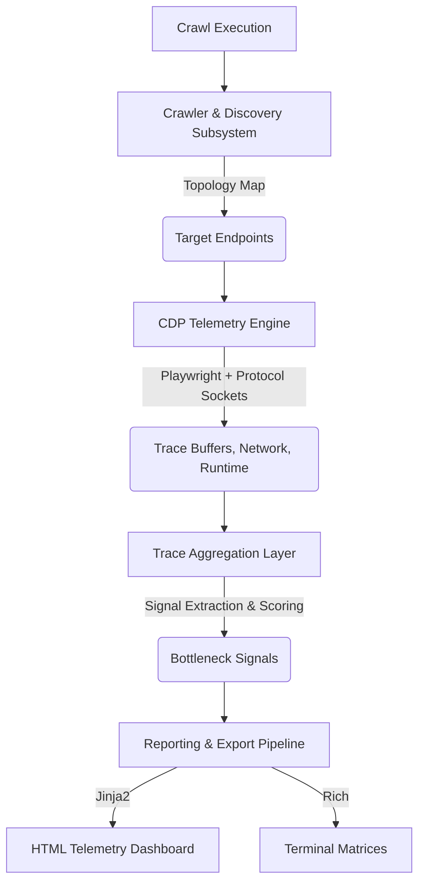

# 🔬 ChromeLens

**Fleet-wide deterministic CDP telemetry for modern web architectures.**

[](https://badge.fury.io/py/chromelens)
[](https://opensource.org/licenses/Apache-2.0)

ChromeLens is a systems-grade performance analysis engine. It crawls your web architecture, attaches Chrome DevTools Protocol (CDP) sockets to each route, and extracts low-level rendering pipeline traces to surface likely main-thread bottlenecks.

### The Telemetry Gap
Lighthouse is a snapshot. It tells you a single page is slow. 
**ChromeLens is an MRI. It maps rendering bottlenecks across your entire fleet.**

Instead of testing isolated URLs and guessing at Web Vitals, ChromeLens automates trace collection at scale—aggregating massive multi-megabyte trace payloads into deterministic bottleneck data (V8 compilation locks, layout thrashing, and unoptimized SPA hydration states).


*Watch the dashboard trace in action: [Dashboard Walkthrough Animation](assets/demo_walkthrough.webp)*

---

## 🚀 Core Capabilities

- **Automated Fleet Discovery:** Crawls and profiles entire site topologies concurrently via Playwright link extraction and sitemaps. Discards noise, obeys `robots.txt`.
- **Deterministic CDP Tracing:** Captures low-level Chrome metrics directly from the protocol (Long Tasks >50ms, Garbage Collection pauses, Paint counts, Script execution bounds).
- **Interactive Flow Telemetry:** Bypass static loads and programmatically script user journeys (clicks, form fills, SPA navigations) while continuously streaming hardware CPU and JS Heap utilization.
- **Third-Party Payload Mapping:** Aggregates network waterfalls by domain and estimates which external scripts are contributing the most cost to your render path.
- **CI/CD Ready:** Dumps stable machine-readable JSON artifacts, supports diffing prior runs, and generates highly visual HTML dashboards for immediate PR regression analysis.

---

## 🌊 Interaction Flow Profiling

ChromeLens includes an advanced mode where you can bypass the standard static crawl and write programmatic Playwright scripts to emulate full user journeys (like adding an item to a cart or navigating a complex SPA).


*Watch the dynamic chart react to simulated user interactions on Flipkart: [Demo Video](assets/flipkart_flow.webp)*

By implementing `interaction_fn` inside `profile_flow`, the engine captures the Javascript Heap accumulations and Main Thread CPU activity specifically triggered by user input, producing a hardware timeline synced perfectly to visual rendering filmstrips!

---

## 📱 Network & Device Emulation

ChromeLens allows you to simulate real-world conditions by throttling network speeds and emulating specific hardware devices. This is critical for understanding how your application performs on lower-end devices or unstable connections.

### Demo: Flipkart on Different Networks
We profiled a heavy e-commerce platform like **Flipkart** across various network profiles to see the impact on load times and TBT (Total Blocking Time). 

| Network Profile | Load Event (ms) | Total Blocking Time (ms) | Profile Duration (s) |
| :--- | :---: | :---: | :---: |
| **Native (Unthrottled)** | 2208ms | 2949ms | 8.18s |
| **LTE (12 Mbps)** | 2113ms | 2650ms | 7.37s |
| **Starbucks (5 Mbps)** | 3999ms | 3598ms | 10.95s |
| **Slow-3G (0.4 Mbps)** | *Timed Out* | *Timed Out* | 30s+ |

> [!NOTE]
> Heavy sites like Flipkart can take significantly longer to load on throttled connections. ChromeLens captured the increasing "Hydration Penalty" as total blocking time climbed to 3.6s on a simulated Starbucks connection. 

### Example Commands:
```bash
# Profile a site as a Pixel 5 on a Starbucks Wi-Fi connection
chromelens crawl https://example.com --device "Pixel 5" --network "starbucks"

# test your site's offline/service-worker behavior
chromelens crawl https://example.com --network "offline"
```

---

## 🛠️ Systems Architecture

ChromeLens is engineered across 4 distinct processing subsystems:



1. **Crawler & Discovery Subsystem:** Concurrently traverses DOM trees and sitemaps, respecting `robots.txt` and mapping same-origin topologies.
2. **CDP Telemetry Engine:** Interfaces directly with Playwright to stream low-level Chrome DevTools Protocol events (Tracing, Network, Runtime) into memory buffers.
3. **Trace Aggregation Layer:** Parses massive multi-megabyte JSON traces, isolating >50ms main-thread long tasks, identifying layout thrashing, and scoring third-party script bloat.
4. **Reporting & Export Pipeline:** Serializes the normalized data structures into deterministic HTML artifact drops and machine-readable data for CI ingestion.

---

## 📦 Quickstart

ChromeLens requires Python 3.10+.

1. Clone and Install ChromeLens:
   ```bash
   git clone https://github.com/manishklach/chromelens.git
   cd chromelens
   pip install -e .
   ```

2. Provision the Playwright Chromium binary:
   ```bash
   playwright install chromium
   ```

3. Profile a target architecture (outputting to `reports/telemetry`):
   ```bash
   chromelens crawl https://example.com --max-pages 20 --output reports/telemetry
   ```

*(If the `chromelens` command is not in your PATH, use `python -m chromelens.cli crawl ...`)*

### Config Options:
- `--output`, `-o`: Dest for the HTML drop (default: `reports/chromelens`).
- `--max-pages`: Bounding limit for discovered pages (default: `20`).
- `--max-depth`: Max recursion depth (default: `3`).
- `--network`: Throttle network constraints (`lte`, `fast-3g`, `slow-3g`, `mcdonalds`, `starbucks`, `airport`, `offline`).
- `--device`: Emulate a specific mobile Playwright device (e.g. `"Pixel 5"`, `"iPhone 13"`).
- `--headless`/`--headed`: Toggle Chrome visibility.
- `--screenshots`: Toggle filmstrip / snapshot generation (default: `True`).
- `--artifact-path`: Persist a stable run artifact JSON (defaults to `<output>/run.json`).
- `--template-clustering`: Choose `auto`, `rules`, or `off`.
- `--route-patterns`: Load custom route normalization rules from JSON or YAML.
- `--export-har`: Export HAR files with `per-page`, `combined`, or `both`.

### Run Artifacts

Every crawl can now emit a stable `run.json` artifact containing:

- crawl metadata
- per-page vitals and trace summaries
- template aggregates
- third-party cost summaries with explicit confidence/method labels
- best-effort CLS culprit summaries

Example:
```bash
chromelens crawl https://example.com \
  --output reports/example \
  --artifact-path reports/example/run.json \
  --template-clustering auto
```

### Route Clustering

ChromeLens can cluster route families like `/products/123` and `/products/456` into a template such as `/products/:id`.

Use the built-in heuristic clustering:
```bash
chromelens crawl https://example.com --template-clustering auto
```

Or provide custom patterns:
```bash
chromelens crawl https://example.com \
  --template-clustering rules \
  --route-patterns docs/examples-route-patterns.yaml
```

### Diffing Runs

Diff two prior ChromeLens runs without re-crawling:

```bash
chromelens diff reports/main/run.json reports/pr/run.json \
  --output reports/pr-diff \
  --fail-on-regression \
  --max-tbt-regression-pct 15 \
  --max-cls-regression 0.03 \
  --max-script-duration-regression-pct 10
```

This produces:

- `diff.json`
- `diff.html`
- a CI-friendly exit code of `2` when configured thresholds fail

The diff engine is stable enough for CI gating, but it is not a statistical anti-flake system. Zero-baseline regressions are handled explicitly rather than silently treated as `0%`.

### Headless vs Headed Reality Check

Run the same discovered route set in both browser modes:

```bash
chromelens compare-modes https://example.com \
  --output reports/reality-check \
  --reality-threshold-tbt-ms 100 \
  --reality-threshold-cls 0.03
```

ChromeLens writes:

- `headless/run.json`
- `headed/run.json`
- `compare/mode-diff.json`
- `compare/mode-diff.html`

Headless versus headed comparisons are environment-sensitive and should be treated as a reality check, not an absolute source of truth.

### HAR Export

Export HAR files alongside the regular report:

```bash
chromelens crawl https://example.com --export-har per-page
chromelens crawl https://example.com --export-har both
```

HAR output is intended for interoperability and inspection. It reflects ChromeLens' captured network view and does not claim full trace-level fidelity.

### Docker / CI

Build the bundled Docker image:

```bash
docker build -t chromelens-ci .
```

Run a crawl and write reports to the host:

```bash
docker run --rm \
  -v "$(pwd)/reports:/reports" \
  chromelens-ci crawl https://example.com --output /reports/example --artifact-path /reports/example/run.json
```

The repo also includes a sample GitHub Actions workflow at `.github/workflows/chromelens-smoke.yml`.

---

## 🗺️ Engineering Roadmap

- **v0.2.x Current Framework:** Static fleet discovery, Vitals extraction, Third-party payload mapping, Interaction Flow CPU/Mem profiling.
- **Near-term Pipeline:**
  - Stronger script URL attribution inside traces for higher-confidence third-party CPU accounting.
  - More detailed screenshot overlays for CLS culprit visualization.
  - Native `.json` raw Chrome Trace exports for DevTools importing.
- **Research Stage:**
  - Performance Diffing (Overlay traces from PR builds vs Main branch).
  - Statistical Anti-Flake Execution models.

---

## 📋 License

Apache-2.0 License
